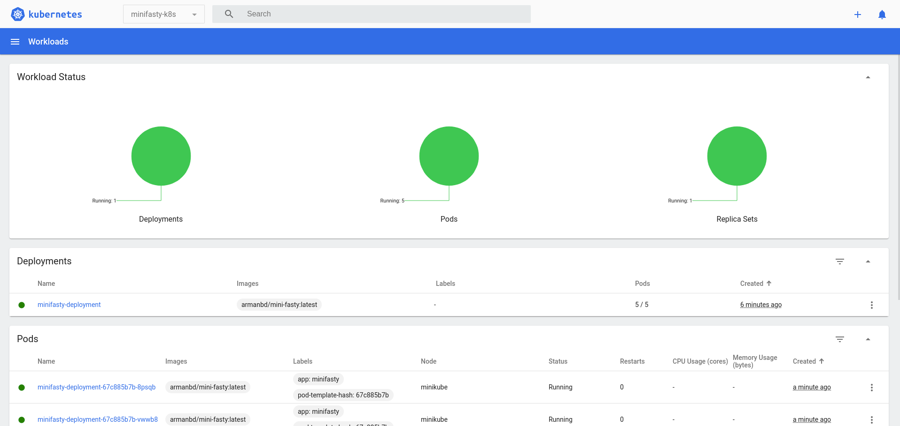
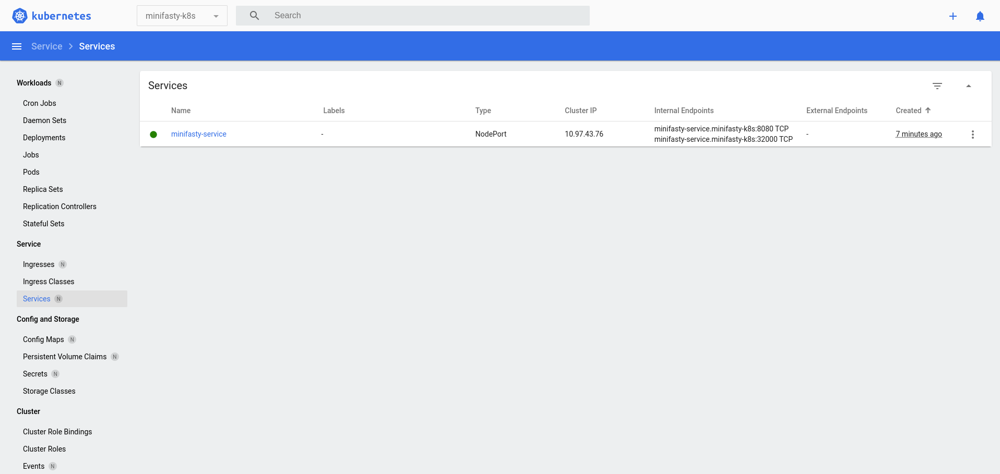
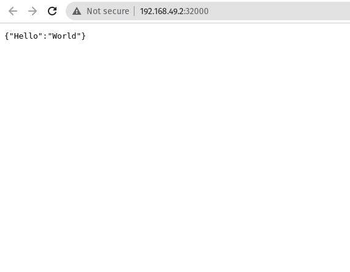

# Mini Fasty
A FastAPI project with Docker, Kubernetes &amp; Terraform.

## Requirements

- [Docker](https://docs.docker.com/get-docker/)
- [Minikube](https://minikube.sigs.k8s.io/docs/start/)
- [Terraform](https://learn.hashicorp.com/tutorials/terraform/install-cli)
- [Kubectl](https://kubernetes.io/docs/tasks/tools/install-kubectl/)
- [Helm](https://helm.sh/docs/intro/install/)

### Build Dcker Image

First you need to create a doker hub account and create a repository. Then you need to login to docker hub.

```bash
docker login
```

Then you need to build the docker image.

```bash
docker build -t <your_dockerhub_username>/fasty:latest .
```

After that you need to push the image to docker hub.

```bash
docker push <your_dockerhub_username>/fasty:latest
```

### Deploy to Kubernetes

First you need to start minikube.

```bash
minikube start
```

### Deploy to Kubernetes with Terraform

```bash
cd terraform
terraform init
terraform apply
```

## In Action

**Kubernetes Dashboard: Workloads**



**Kubernetes Dashboard: Services**



**NodePort**



## License

This project is licensed under the terms of the [MIT license](/LICENSE).